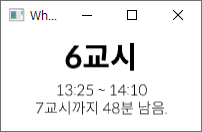

# What Class
지금이 몇교시인지, 다음 시간은 몇 분 뒤 시작하는지 알려주는 데스크탑 프로그램입니다.

## 스크린샷


## 시간표 커스터마이징
현재 시간표는 소스코드에 하드코딩되어 있습니다. [소스 코드](./src/main.rs#L88-L116)를 본인 시간표에 맞추어 수정한 뒤 직접 빌드해 사용하세요.

## 빌드하기
`Cargo`를 사용하시면 간단하게 빌드할 수 있습니다.
```sh
# 개발용 빌드
cargo build
# 개발용 빌드 & 실행
cargo run
# 릴리즈용 빌드
cargo build --release
```
